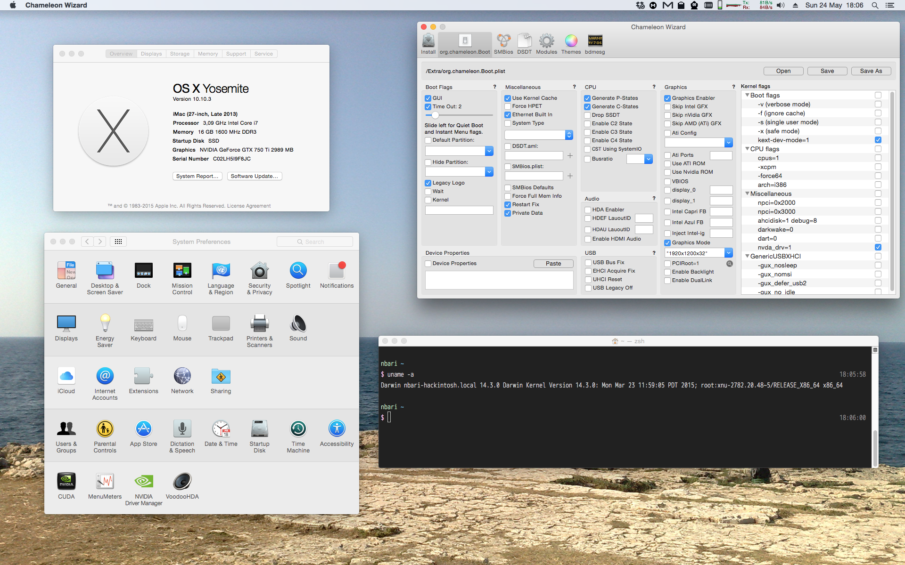
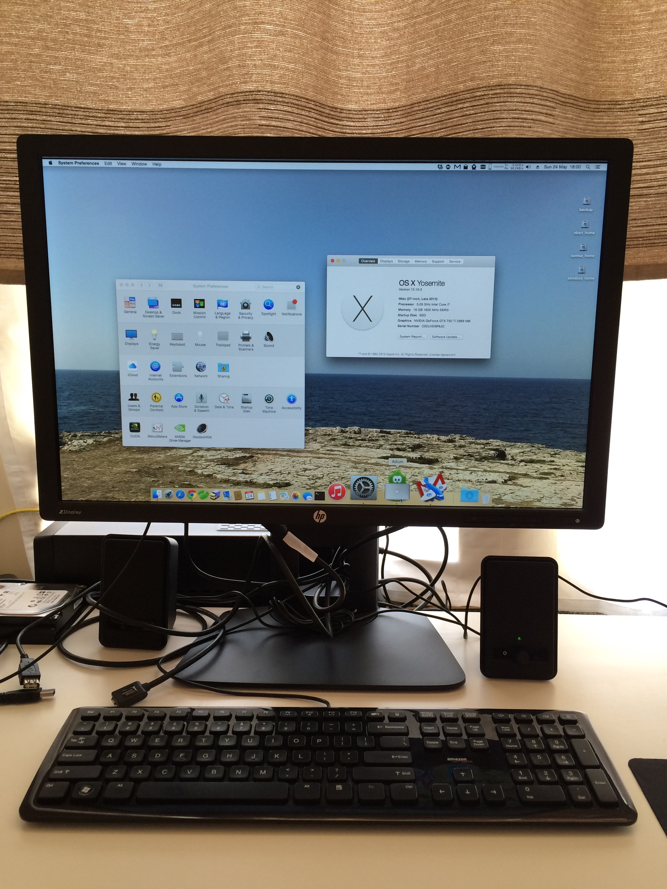
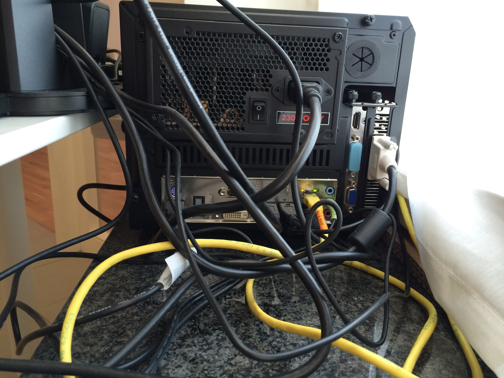

# hackintosh

My Hardware:

* Motherboard: [H87I-Plus](http://www.asus.com/Motherboards/H87IPLUS/)
* Video card: ASUS GeForce GTX 750 TI [GTX750TI-PH-2GD5](https://www.asus.com/Graphics_Cards/GTX750TIPH2GD5/)
* 16 GB RAM
* CPU i7-4770S 3.1GHZ (matches the [Apple iMac "Core i7" 3.1 21.5-Inch (Late 2013) Specs][3])

Setup
-----

I used this steps to install Mac OS X on an external disk attached via USB 3.

Download Mac OS X and use [UniBeast][1] to create a bootable USB.

Boot using the USB, while on the boot loader menu, press space bar and on the
boot options type:

    -v -x nv_disable=1

That will allow to continue with the setup (bad graphics but you can fix that
latter), after installing it will ask to reboot and again use the
``nv_disable=1``, once logged in, download and install the latest
[nvidia web drivers][2], reboot and this time use:

    nva_drv=1

Flash Video card ROM (backup your original)
===========================================

Before doing this, find how to backup your current working ROM, in case you need
to revert any changes.

For some reason I could not make work the GTX 750 TI video card with it's
default ROM, I need to flash under windows:

    nvflash --protectoff
    nvflash -6 Palit.GTX750Ti.2048.140214.rom
    nvflash --protecton

After doing this and rebooting, I lost video, the DVI connector I was using some
home became disable, fortunately I just switch the DVI cable to available
adjacent connector and got video signal again

Sound
-----

Using MultiBeast installed VoodooHDA v2.8.7:

    Drivers > Audio > Universal > VoodooHDA v2.8.7

Sleep mode
----------

I need to press the power on/off button to wake the machine, but I can also wake
it up by pressing or moving the mouse using this settings:

    <string>kext-dev-mode=1 nvda_drv=1 darkwake=0 -gux_defer_usb2</string>

References:

http://www.tonymacx86.com/

[1]: http://www.tonymacx86.com/downloads.php?do=cat&id=3
[2]: http://www.insanelymac.com/forum/topic/301416-nvidia-web-driver-updates-for-yosemite/
[3]: http://www.everymac.com/systems/apple/imac/specs/imac-core-i7-3.1-21-inch-aluminum-late-2013-specs.html
